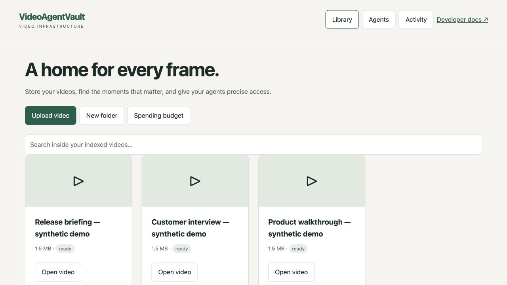
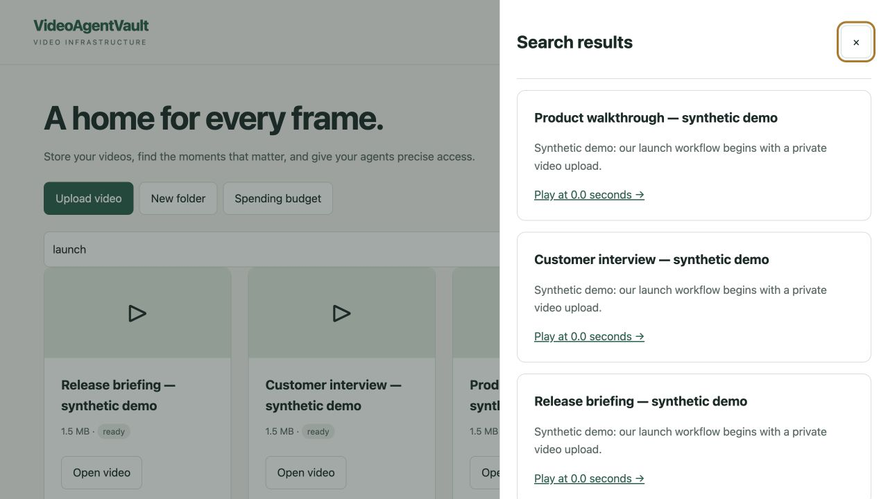
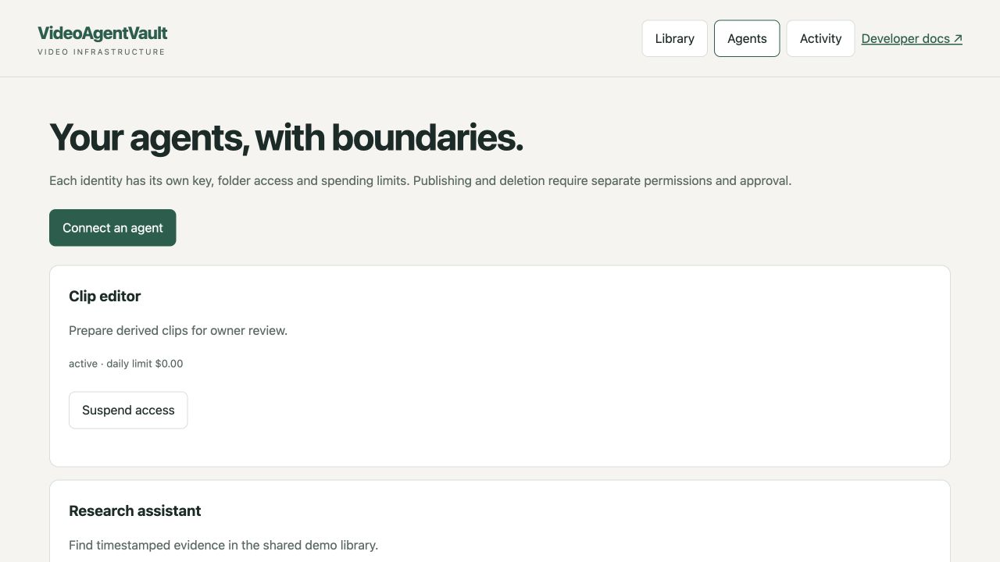
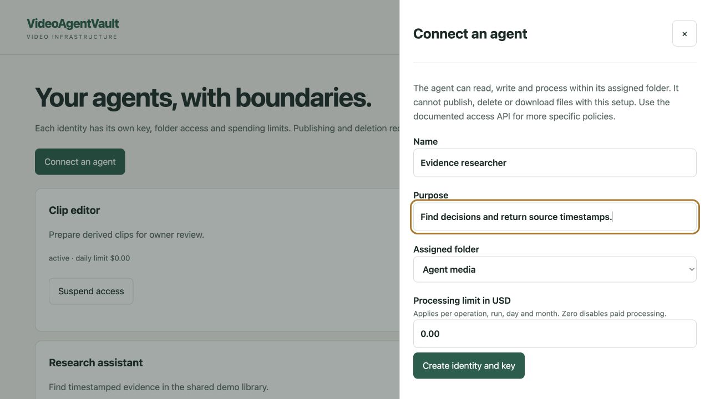
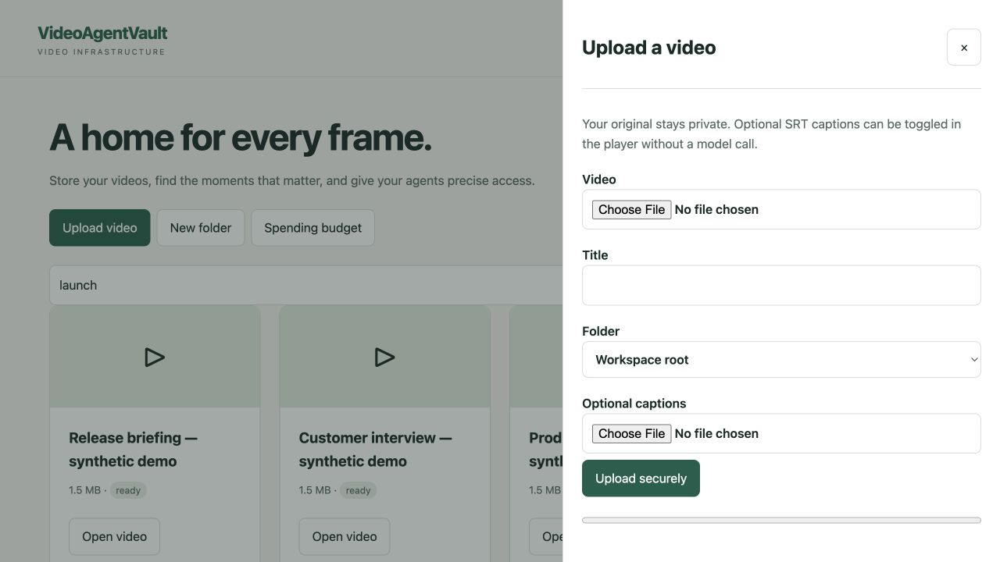
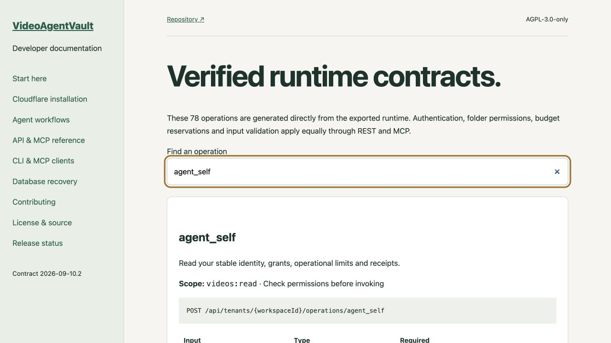
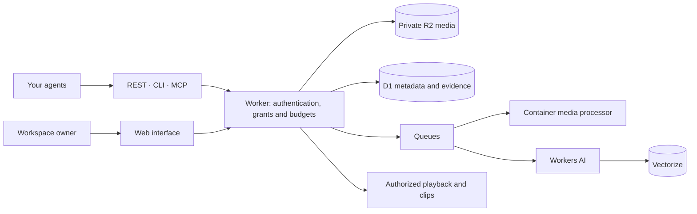

<div align="center">

# VideoAgentVault

### Give your agents a place to work with video.

**Store privately · Find the right moment · Return evidence and clips**

Video infrastructure in your own Cloudflare account.<br>
One workspace. Independent agents. A shared contract across REST, CLI and MCP.

[](https://github.com/vidhatanand/VideoAgentVault/actions/workflows/verify.yml)
[](https://vidhatanand.github.io/VideoAgentVault/)
[](LICENSE)

[Documentation](https://vidhatanand.github.io/VideoAgentVault/) · [Installation](#installation) · [Gallery](#gallery) · [Connect an agent](#connect-an-agent) · [Contributing](CONTRIBUTING.md)

</div>

> [!IMPORTANT]
> **Development preview.** The code, CLI and documentation are public; full production acceptance is still open. Local tests and isolated database recovery have passed. Hosted installation, owner login, real-media intelligence and complete recovery still need acceptance. See the [release checklist](docs/RELEASE_STATUS.md) before deploying for production use.

## Why VideoAgentVault?

A recording contains decisions, demonstrations and evidence. But to an agent, a video file alone is a difficult starting point. The agent needs to find a moment, cite its source, retrieve a clip and let a person watch it—while respecting who may access the material and what the work may cost.

VideoAgentVault brings those steps into one workspace. Upload a recording once, attach captions or build an index, and let authorized agents work from the same source. Preserve timestamps and source references as work becomes findings, summaries or derived clips.

Your agent can keep running wherever you already run it. VideoAgentVault provides the video storage, intelligence operations, access controls and delivery interfaces it calls.

> “Find the part of this product walkthrough where the launch process is explained. Return the evidence and prepare a clip for review.”

## What you can build

| Workflow | What the agent does | What a person gets |
| :-- | :-- | :-- |
| **Video research** | Search recordings and collect evidence tied to source intervals | Findings with timestamps and a route back to the recording |
| **Content production** | Find useful moments, compose clips and request exports | Derived work ready for review before publishing |
| **Searchable recording libraries** | Upload, organize and index demonstrations, interviews or briefings | A library people and agents can search together |
| **Collaboration between agents** | Work in assigned folders and explicitly shared areas, with revision checks and task claims | Separate responsibilities with controlled access to shared material |
| **Video inside another product** | Retrieve metadata, clips and authorized playback sessions | A player backed by private media and expiring access |

## Gallery

**Actual application and documentation captures.** The application screenshots use an isolated local instance with synthetic recordings, demo agents and imported transcript fixtures. No private recordings, keys or account data are shown. The search capture demonstrates keyword retrieval; it does not demonstrate hosted AI processing. Click any image to inspect it at full size.

<table>
<tr>
<td width="50%" valign="top">
<a href="docs/assets/gallery/library.jpg"></a>
<strong>A shared video library</strong><br>
Keep recordings organized and open the actions for each video.
</td>
<td width="50%" valign="top">
<a href="docs/assets/gallery/search.jpg"></a>
<strong>Search that points to a moment</strong><br>
Retrieve transcript evidence with a link back to its timestamp.
</td>
</tr>
<tr>
<td width="50%" valign="top">
<a href="docs/assets/gallery/agents.jpg"></a>
<strong>Named agents with boundaries</strong><br>
Manage independent identities, spending limits and suspension.
</td>
<td width="50%" valign="top">
<a href="docs/assets/gallery/agent-access.jpg"></a>
<strong>Access starts with an explicit grant</strong><br>
Choose an agent's purpose, working folder and processing allowance.
</td>
</tr>
<tr>
<td width="50%" valign="top">
<a href="docs/assets/gallery/upload.jpg"></a>
<strong>Bring your own captions</strong><br>
Upload a video with an optional SRT track for player captions.
</td>
<td width="50%" valign="top">
<a href="docs/assets/gallery/agent-contract.jpg"></a>
<strong>Discoverable agent contracts</strong><br>
Inspect the same operation schemas used by the runtime and CLI.
</td>
</tr>
</table>

[Capture notes and verification boundaries](docs/GALLERY.md)

## Capabilities

The runtime exposes **78 stored-video operations** through REST and MCP. The CLI uses a generated catalogue of the same contracts.

| Area | Included capabilities |
| :-- | :-- |
| **Store and organize** | Resumable uploads, folders, tags, source versions and storage inventory |
| **Understand and retrieve** | Transcript import, speech and sampled visual indexing, keyword and semantic search, evidence bundles, summaries and video questions |
| **Produce derived work** | Clip composition, previews, exports, reusable recipes and bounded batches |
| **Deliver** | Authorized playback sessions, HLS playback, caption tracks, sharing controls and download permissions |
| **Control agent access** | Named identities, independent keys, folder/video grants, revocation, budgets, revision checks and task claims |
| **Observe work** | Job state, processing progress where available, replayable job events, usage records and reconciliation of uncertain mutations |

Hosted model and media processing are implemented but remain subject to the [release acceptance gates](docs/RELEASE_STATUS.md). A caption track and a searchable transcript are separate: `captions_save` adds player captions; `transcript_import` creates searchable text.

### Owner interface and developer tools

| Surface | Features | Availability |
| :-- | :-- | :-- |
| **Owner sign-in** | Cloudflare Access assertions and one-workspace membership | Hosted login acceptance open |
| **Library UI** | Video cards, folders, uploads, optional SRT, keyword search and per-video actions | Captured locally in the gallery |
| **Agent management UI** | Named identities, key creation, assigned folders, spending limits and suspension | Local UI and API paths; use access APIs for finer grants |
| **Video and activity UI** | Player controls, analysis/summary/question forms, processing estimates and job progress/results | Paid hosted processing and browser playback acceptance open |
| **Workspace allowance** | Owner-authorized processing allowance and per-agent limits | Estimates and reservations; not an account-wide billing cap |
| **CLI** | Resumable uploads, caption reconciliation, operation calls, job/event watching, downloads, profiles and shell completion | Extracted preview package tested |
| **MCP** | Direct HTTP endpoint, stdio CLI bridge, scoped discovery and structured tool calls | Official Inspector tested locally |
| **Documentation** | Generated input/output schemas, OpenAPI, machine-readable contracts and agent workflows | Published on GitHub Pages |
| **Installer and doctor** | Saved resource plan, prerequisite checks, ownership validation and ambiguous-create stop | Hosted installation acceptance open |
| **Recovery** | Consistent logical D1 capture, checksums, schema/row restoration and rebuilt full-text indexes | Isolated D1 round trip passed; full installation recovery open |

### Complete operation catalogue

Expand a group to see **every published operation**, its purpose and required permission scope. These tables are generated from the code with `npm run docs:readme`; tests reject missing, duplicated or stale entries.

<!-- feature-catalogue:start -->

Contract `2026-09-10.2`. Every operation below comes from the runtime catalogue. Permission scopes still apply; a key sees only its authorized tools. Hosted availability depends on the configured services.

<details>
<summary><strong>Storage and library</strong> · 19 operations</summary>

| Operation | What it enables | Required scope |
| :-- | :-- | :-- |
| [`videos_list`](https://vidhatanand.github.io/VideoAgentVault/reference.html#videos_list) | List videos, including folder/tag filters. workspace is fixed by the API key. | `videos:read` |
| [`video_get`](https://vidhatanand.github.io/VideoAgentVault/reference.html#video_get) | Read metadata, tags, object sizes and processing status. Does not expose source bytes. | `videos:read` |
| [`video_update`](https://vidhatanand.github.io/VideoAgentVault/reference.html#video_update) | Rename, describe, move, tag or change visibility. Privacy changes revoke existing playback tokens. | `videos:write` |
| [`videos_bulk_move_tag`](https://vidhatanand.github.io/VideoAgentVault/reference.html#videos_bulk_move_tag) | Move/tag up to 50 videos belonging to the key workspace. | `videos:write` |
| [`upload_create`](https://vidhatanand.github.io/VideoAgentVault/reference.html#upload_create) | Create a resumable MP4/WebM/MOV/audio/image or HLS upload. Return video ID; upload binary via REST, then upload_complete. | `videos:write` |
| [`upload_status`](https://vidhatanand.github.io/VideoAgentVault/reference.html#upload_status) | Return acknowledged parts for resuming a binary upload. | `videos:write` |
| [`upload_complete`](https://vidhatanand.github.io/VideoAgentVault/reference.html#upload_complete) | Validate all parts or every local HLS reference before publishing. | `videos:write` |
| [`video_delete`](https://vidhatanand.github.io/VideoAgentVault/reference.html#video_delete) | Revoke playback immediately and queue irreversible storage/index deletion. Requires confirmDelete=true. | `videos:write` |
| [`folders_list`](https://vidhatanand.github.io/VideoAgentVault/reference.html#folders_list) | List hierarchical folders and counts. | `videos:read` |
| [`folder_create`](https://vidhatanand.github.io/VideoAgentVault/reference.html#folder_create) | Create a folder; parent must be inside this workspace. | `folders:write` |
| [`folder_update`](https://vidhatanand.github.io/VideoAgentVault/reference.html#folder_update) | Rename/move a folder. Cycles and cross-workspace parents are rejected. | `folders:write` |
| [`folder_delete`](https://vidhatanand.github.io/VideoAgentVault/reference.html#folder_delete) | Delete an empty folder only. | `folders:write` |
| [`tags_list`](https://vidhatanand.github.io/VideoAgentVault/reference.html#tags_list) | List tags and video counts. | `videos:read` |
| [`tag_create`](https://vidhatanand.github.io/VideoAgentVault/reference.html#tag_create) | Create a reusable workspace tag. | `tags:write` |
| [`tag_rename`](https://vidhatanand.github.io/VideoAgentVault/reference.html#tag_rename) | Rename a tag and update affected video metadata. | `tags:write` |
| [`tag_delete`](https://vidhatanand.github.io/VideoAgentVault/reference.html#tag_delete) | Remove a tag without deleting videos. | `tags:write` |
| [`storage_inventory`](https://vidhatanand.github.io/VideoAgentVault/reference.html#storage_inventory) | Rank accessible media by estimated customer storage charges, recorded usage and explainable review priority. Unknown use is not evidence of disuse. | `videos:read` |
| [`storage_asset`](https://vidhatanand.github.io/VideoAgentVault/reference.html#storage_asset) | Inspect source and derived files, usage confidence and cleanup blockers. Files are paginated. | `videos:read` |
| [`storage_cleanup_preview`](https://vidhatanand.github.io/VideoAgentVault/reference.html#storage_cleanup_preview) | Preview removal of whole videos at exact revisions. No deletion occurs. Resolve blockers and request human approval through approval_request before video_delete. | `videos:read` |

</details>

<details>
<summary><strong>Intelligence and source evidence</strong> · 8 operations</summary>

| Operation | What it enables | Required scope |
| :-- | :-- | :-- |
| [`search_keyword`](https://vidhatanand.github.io/VideoAgentVault/reference.html#search_keyword) | Search indexed text with timestamp citations and folder/tag filters. Semantic search uses a budgeted processing job. | `search:read` |
| [`transcript_get`](https://vidhatanand.github.io/VideoAgentVault/reference.html#transcript_get) | Read timestamped index artifacts. | `search:read` |
| [`transcript_import`](https://vidhatanand.github.io/VideoAgentVault/reference.html#transcript_import) | Import caller-supplied timestamped transcript segments; indexed for keyword search without a model call. | `intelligence:write` |
| [`source_versions`](https://vidhatanand.github.io/VideoAgentVault/reference.html#source_versions) | List immutable source identities and measured or unknown content fingerprints. Legacy unknown hashes cannot establish content equality. | `videos:read` |
| [`evidence_search`](https://vidhatanand.github.io/VideoAgentVault/reference.html#evidence_search) | Search authorized immutable evidence by text, source, interval, layer and language. Visual descriptions are sampled; legacy provenance is explicitly unknown. | `search:read` |
| [`evidence_bundle`](https://vidhatanand.github.io/VideoAgentVault/reference.html#evidence_bundle) | Reauthorize up to fifty source-linked evidence references as a comparison or citation bundle. Fails if any reference is inaccessible. | `search:read` |
| [`finding_import`](https://vidhatanand.github.io/VideoAgentVault/reference.html#finding_import) | Append caller-produced findings with an immutable source version and interval. Caller/model claims are not certified by the platform. | `intelligence:write` |
| [`media_result_import`](https://vidhatanand.github.io/VideoAgentVault/reference.html#media_result_import) | Bind a probed, uploaded local audio or rendered video to its immutable input source and declared time interval. Enforces lineage access; producer claims remain caller-supplied. | `intelligence:write` |

</details>

<details>
<summary><strong>Processing, clips and repeatable work</strong> · 21 operations</summary>

| Operation | What it enables | Required scope |
| :-- | :-- | :-- |
| [`timeline_delete`](https://vidhatanand.github.io/VideoAgentVault/reference.html#timeline_delete) | Delete an owned timeline after exact human approval. | `timelines:write` |
| [`timelines_list`](https://vidhatanand.github.io/VideoAgentVault/reference.html#timelines_list) | List saved edit timelines. | `videos:read` |
| [`timeline_save`](https://vidhatanand.github.io/VideoAgentVault/reference.html#timeline_save) | Save exact cuts/concatenation, crop/contain, fade and text overlays. Rendering is a separate budgeted job. | `timelines:write` |
| [`clips_compose`](https://vidhatanand.github.io/VideoAgentVault/reference.html#clips_compose) | Reuse independent muxed HLS segments without re-encoding. Compatible ladders only, bounded segment count; returns expanded actual boundaries. Sources cannot be deleted while clips reference them. | `videos:write` |
| [`jobs_list`](https://vidhatanand.github.io/VideoAgentVault/reference.html#jobs_list) | List job states, results and provisional cost summaries. | `videos:read` |
| [`job_get`](https://vidhatanand.github.io/VideoAgentVault/reference.html#job_get) | Get full job state/events and separately labeled cost receipts. | `videos:read` |
| [`processing_quote`](https://vidhatanand.github.io/VideoAgentVault/reference.html#processing_quote) | Read a conservative credit hold, with no paid work started. | `processing:write` |
| [`processing_start`](https://vidhatanand.github.io/VideoAgentVault/reference.html#processing_start) | Start a budget-authorized job. Paid calls are not automatically enabled by upload. requestKey is idempotent. | `processing:write` |
| [`job_cancel`](https://vidhatanand.github.io/VideoAgentVault/reference.html#job_cancel) | Cancel queued/running work; already incurred provider costs are retained. | `processing:write` |
| [`processing_plan`](https://vidhatanand.github.io/VideoAgentVault/reference.html#processing_plan) | Choose R2 reuse, FFmpeg, AI or explicitly requested Stream. Returns expiring plan with source snapshot and quote; no paid work. | `processing:write` |
| [`processing_plan_get`](https://vidhatanand.github.io/VideoAgentVault/reference.html#processing_plan_get) | Read the exact saved plan and server quote; reject expired or changed source snapshots. | `processing:write` |
| [`processing_plan_execute`](https://vidhatanand.github.io/VideoAgentVault/reference.html#processing_plan_execute) | Execute the exact approved plan once. Rejects expired/stale plans and insufficient credit approval. Never silently falls back. | `processing:write` |
| [`processing_reuse`](https://vidhatanand.github.io/VideoAgentVault/reference.html#processing_reuse) | Reuse an exact authorized successful or in-flight operation, or create one bounded job. Unknown source fingerprints require explicit reuse:false. | `processing:write` |
| [`recipe_create`](https://vidhatanand.github.io/VideoAgentVault/reference.html#recipe_create) | Save an immutable version with exact source and track snapshots, and up to eight bounded variants. Does not start processing. | `processing:write` |
| [`recipe_list`](https://vidhatanand.github.io/VideoAgentVault/reference.html#recipe_list) | List recipes whose inputs remain readable. | `videos:read` |
| [`recipe_get`](https://vidhatanand.github.io/VideoAgentVault/reference.html#recipe_get) | Read a recipe and reauthorize every input. | `videos:read` |
| [`batch_start`](https://vidhatanand.github.io/VideoAgentVault/reference.html#batch_start) | Run recipe variants serially within the total credit ceiling and current grants. Stops after a failed variant or changed input. | `processing:write` |
| [`batch_list`](https://vidhatanand.github.io/VideoAgentVault/reference.html#batch_list) | List accessible batch progress and recorded charges. | `videos:read` |
| [`batch_get`](https://vidhatanand.github.io/VideoAgentVault/reference.html#batch_get) | Read actual completed variants, job references and settled credit charges. | `videos:read` |
| [`batch_cancel`](https://vidhatanand.github.io/VideoAgentVault/reference.html#batch_cancel) | Stop future variants and request cancellation of active processing on the next recovery tick. | `processing:write` |
| [`job_events`](https://vidhatanand.github.io/VideoAgentVault/reference.html#job_events) | Replay authorized stored-video job state events after a durable sequence cursor. Poll until terminal and no more items. No live monitoring. | `videos:read` |

</details>

<details>
<summary><strong>Playback, captions and delivery</strong> · 11 operations</summary>

| Operation | What it enables | Required scope |
| :-- | :-- | :-- |
| [`playback_create`](https://vidhatanand.github.io/VideoAgentVault/reference.html#playback_create) | Create a short-lived, revocable viewing session. viewerId must be a stable pseudonymous end-user ID when using an app key. Tokens are sensitive. | `playback:create` |
| [`playback_revoke`](https://vidhatanand.github.io/VideoAgentVault/reference.html#playback_revoke) | Revoke all playback sessions/tokens for a video. | `videos:write` |
| [`share_create`](https://vidhatanand.github.io/VideoAgentVault/reference.html#share_create) | Create an expiring secret share URL for a video. Treat it as a password. | `videos:write` |
| [`share_revoke`](https://vidhatanand.github.io/VideoAgentVault/reference.html#share_revoke) | Revoke a share link and its ability to authorize playback. | `videos:write` |
| [`media_tracks_list`](https://vidhatanand.github.io/VideoAgentVault/reference.html#media_tracks_list) | List caption and alternate audio tracks including language and defaults. | `videos:read` |
| [`captions_save`](https://vidhatanand.github.io/VideoAgentVault/reference.html#captions_save) | Create or replace a plain-text VTT/SRT caption track. No model call; also refreshes playable captions. | `intelligence:write` |
| [`audio_track_attach`](https://vidhatanand.github.io/VideoAgentVault/reference.html#audio_track_attach) | Attach an already uploaded same-workspace audio asset. A subsequent approved transcode packages it into HLS. | `processing:write` |
| [`media_track_delete`](https://vidhatanand.github.io/VideoAgentVault/reference.html#media_track_delete) | Tombstone a track. Audio already embedded in an old HLS generation needs a new transcode to disappear. | `intelligence:write` |
| [`exports_list`](https://vidhatanand.github.io/VideoAgentVault/reference.html#exports_list) | List generated MP4/M4A exports and revocation state. | `videos:read` |
| [`download_create`](https://vidhatanand.github.io/VideoAgentVault/reference.html#download_create) | Issue a short-lived export URL, only when downloads are enabled. Treat URL as a secret; already copied data cannot be recalled. | `downloads:create` |
| [`export_revoke`](https://vidhatanand.github.io/VideoAgentVault/reference.html#export_revoke) | Revoke an export and its download grants. | `videos:write` |

</details>

<details>
<summary><strong>Agent access, approvals and coordination</strong> · 11 operations</summary>

| Operation | What it enables | Required scope |
| :-- | :-- | :-- |
| [`agent_self`](https://vidhatanand.github.io/VideoAgentVault/reference.html#agent_self) | Read your stable identity, grants, operational limits and receipts. | `videos:read` |
| [`access_explain`](https://vidhatanand.github.io/VideoAgentVault/reference.html#access_explain) | Check access without disclosing inaccessible resource metadata. | `videos:read` |
| [`approval_request`](https://vidhatanand.github.io/VideoAgentVault/reference.html#approval_request) | Request human approval of exact video revision and publish/share/delete payload. Agents cannot approve. | `videos:read` |
| [`approvals_list`](https://vidhatanand.github.io/VideoAgentVault/reference.html#approvals_list) | Read only approvals requested by your agent. | `videos:read` |
| [`run_create`](https://vidhatanand.github.io/VideoAgentVault/reference.html#run_create) | Record an external objective, input versions, output folder and budget ceiling. | `videos:read` |
| [`runs_list`](https://vidhatanand.github.io/VideoAgentVault/reference.html#runs_list) | List runs owned by your agent. | `videos:read` |
| [`run_get`](https://vidhatanand.github.io/VideoAgentVault/reference.html#run_get) | Read a run and its caller-supplied artifact and job receipts. | `videos:read` |
| [`run_close`](https://vidhatanand.github.io/VideoAgentVault/reference.html#run_close) | Complete or cancel an external run after its paid jobs finish. | `videos:read` |
| [`artifact_submit`](https://vidhatanand.github.io/VideoAgentVault/reference.html#artifact_submit) | Submit a typed finding, transcript or edit draft with declared provenance; no hosted model charge. | `videos:read` |
| [`work_claim`](https://vidhatanand.github.io/VideoAgentVault/reference.html#work_claim) | Claim a video work item with an expiring lease and increasing fencing token. | `videos:read` |
| [`work_claim_update`](https://vidhatanand.github.io/VideoAgentVault/reference.html#work_claim_update) | Renew or release your current fenced claim. Stale owners cannot change it. | `videos:read` |

</details>

<details>
<summary><strong>Analytics and integrations</strong> · 8 operations</summary>

| Operation | What it enables | Required scope |
| :-- | :-- | :-- |
| [`analytics_report`](https://vidhatanand.github.io/VideoAgentVault/reference.html#analytics_report) | Read watch hours, buffering, startup, completion, country and server delivery counters. Client telemetry is not a supplier invoice. | `analytics:read` |
| [`events_list`](https://vidhatanand.github.io/VideoAgentVault/reference.html#events_list) | Read indexed-text detection rules, detections and webhook delivery state. | `videos:read` |
| [`rule_save`](https://vidhatanand.github.io/VideoAgentVault/reference.html#rule_save) | Create/update comma-separated keyword rules applied to new indexed text. Not real-time safety-certified vision. | `events:write` |
| [`webhook_create`](https://vidhatanand.github.io/VideoAgentVault/reference.html#webhook_create) | Create an exact-host-allowlisted HTTPS event destination; signing secret is returned once. | `events:write` |
| [`webhook_disable`](https://vidhatanand.github.io/VideoAgentVault/reference.html#webhook_disable) | Disable a webhook. | `events:write` |
| [`sources_list`](https://vidhatanand.github.io/VideoAgentVault/reference.html#sources_list) | List source metadata without decrypting ingestion credentials. | `videos:read` |
| [`source_create`](https://vidhatanand.github.io/VideoAgentVault/reference.html#source_create) | Register an administrator-allowlisted HTTPS source; ingestion/capture requires a separate processing job. | `sources:write` |
| [`provider_policy_get`](https://vidhatanand.github.io/VideoAgentVault/reference.html#provider_policy_get) | Read owner-controlled Stream permission, default quality and per-job budget ceiling. MCP keys cannot change provider policy. | `videos:read` |

</details>

<details>
<summary><strong>Processing modes</strong> · 15 job kinds</summary>

These modes share the `processing_start` operation. Model calls and container jobs require explicit budgets and configured services. The default preview does not enable the optional Stream paths.

| Mode | What it does | Service or boundary |
| :-- | :-- | :-- |
| `probe` | Inspect media metadata and streams. | Container; hosted acceptance open |
| `transcode` | Prepare adaptive streaming renditions. | Container; hosted acceptance open |
| `preview` | Create previews, poster frames and seek sprites. | Container; hosted acceptance open |
| `export` | Produce MP4 video or M4A audio exports. | Container; hosted acceptance open |
| `index` | Build speech and sampled visual evidence. | Workers AI and processing services |
| `render` | Render composed timelines and derived video. | Container; hosted acceptance open |
| `capture` | Capture a bounded recording from a configured source. | Owner-controlled source access; hosted acceptance open |
| `semantic_search` | Retrieve indexed evidence by semantic similarity. | Workers AI and Vectorize |
| `ask` | Answer questions using indexed video evidence. | Workers AI; hosted acceptance open |
| `summarize` | Produce a structured video summary. | Workers AI; hosted acceptance open |
| `embed_artifacts` | Embed existing artifacts for semantic retrieval. | Workers AI and Vectorize |
| `generate_image` | Generate an image asset with the configured model. | Workers AI; hosted acceptance open |
| `generate_speech` | Generate a speech asset with the configured model. | Workers AI; hosted acceptance open |
| `stream` | Encode through optional Cloudflare Stream and import an MP4. | Disabled in the default preview configuration |
| `stream_import` | Import an existing Stream recording. | Compatibility path; disabled in the default preview configuration |

</details>

<!-- feature-catalogue:end -->

## How it fits together



**One installation owns one workspace.** Agents receive their own keys and explicit grants. Sharing a workspace does not automatically give every agent access to every video. Publishing and deletion have separate permission and approval requirements.

Media processing uses Cloudflare services. Local SQLite and object-storage adapters support development tests; they do not emulate hosted execution, codec performance or provider billing. Live monitoring and platform-hosted agent teams are outside this release's scope.

## Installation

### 1. Get the source and verify it locally

Use **Node 24** and Git. Docker with Buildx is required for processor-image work.

```sh
git clone https://github.com/vidhatanand/VideoAgentVault.git
cd VideoAgentVault
npm ci --ignore-scripts
npm test
npm run docs:build
```

These commands install dependencies, run the application tests and generate the documentation. They create no Cloudflare resources. Prefer a reviewed, pinned commit when preparing an installation.

### 2. Prepare your Cloudflare account

| Prerequisite | Why it is needed |
| :-- | :-- |
| Workers, R2 and D1 | Application execution, private media and metadata |
| Queues, Containers, Workers AI and Vectorize | Hosted processing and intelligence |
| Cloudflare Access team and an owner email | Owner authentication |
| Account-scoped API credentials | Provisioning the selected resources |
| **Access Apps and Policies — Edit** | Creating the owner-login application and policy |
| An explicit test budget | Authorizing a bounded acceptance run |

Supply `CLOUDFLARE_API_TOKEN` securely through your environment. If Access uses a separately scoped credential, set `CLOUDFLARE_ACCESS_API_TOKEN`. Keep both out of commands, Git and agent prompts.

### 3. Generate a plan before creating resources

Replace the account ID, owner address and Access team below with your own values:

```sh
node scripts/install.mjs plan \
  --account YOUR_ACCOUNT_ID \
  --owner owner@example.com \
  --name videoagentvault \
  --access-team YOUR_TEAM.cloudflareaccess.com \
  --budget 2
```

The plan is saved in `.installation/plan.json`. **Planning creates no resources.** Review the account, resource names, owner access and budget before continuing.

<details>
<summary><strong>Apply and deploy the development preview</strong></summary>

Run this only after reviewing the plan and the [full installation guide](docs/INSTALL_AGENT.md). Provisioning creates billable resources.

```sh
node scripts/install.mjs apply --yes
node scripts/install.mjs status
npm run build
npx wrangler deploy --config wrangler.installation.jsonc
```

The generated configuration and installation state contain private identifiers and are ignored by Git. Supply the generated origin, Access team and audience to `node scripts/doctor.mjs --json`; use `--live` for its read-only provider checks. Unknown required capabilities must be resolved before declaring success.

If creation stops with `RECONCILIATION_REQUIRED`, inspect the provider state before retrying. Keep the recorded installation state. An Access 403 means the credential cannot perform that Access operation; listing applications does not establish write permission.

`npm run build` prepares the browser HLS asset and performs a Worker deployment dry run. Real processor-image verification is described in [Contributing](CONTRIBUTING.md).

</details>

**About costs:** you pay Cloudflare directly. Workspace and agent allowances govern estimated processing usage; they are not account-wide billing caps. Storage, requests and other services can incur charges independently. Review job receipts and provider billing separately.

## Connect an agent

Once the installation and owner login are working, create a folder, give an agent a named identity and grant access to that folder. Save its key privately. Start with `agent_self` to inspect the permissions and limits actually granted.

### Use the CLI

Build, verify and install the preview package from this checkout:

```sh
npm run cli:verify
npm install -g ./.release/cli/videoagentvault-cli-0.1.0.tgz
videoagentvault --help
```

The package includes its source, license and generated contracts. A checksummed archive is also retained in successful [verification workflow artifacts](https://github.com/vidhatanand/VideoAgentVault/actions/workflows/verify.yml). It is not published to the npm registry.

Configure your installation and supply the key through `VIDEOAGENTVAULT_API_KEY`, or use `--key-file` with an owner-readable private file:

```sh
export VIDEOAGENTVAULT_ORIGIN="https://video.example.com"
export VIDEOAGENTVAULT_WORKSPACE="t_workspace"

videoagentvault call agent_self --json
videoagentvault folders list --json
videoagentvault call search_keyword --data '{"query":"launch"}' --json
```

Use `call <operation> --help` for the exact input schema. Search needs existing indexed evidence. For resumable uploads, use the folder ID returned for an authorized folder:

```sh
videoagentvault videos upload \
  --file ./walkthrough.mp4 \
  --srt ./captions.srt \
  --folder YOUR_FOLDER_ID \
  --checkpoint ./upload-checkpoint.json \
  --json
```

Paid operations require explicit authorization and a budget. Keep request keys and upload checkpoints so an uncertain response does not become duplicate work. [Read the CLI guide →](docs/CLI.md)

### Use an MCP client

After installing the CLI, configure a client that supports stdio MCP servers. Replace the origin and key-file path with your own values:

```json
{
  "mcpServers": {
    "videoagentvault": {
      "command": "videoagentvault",
      "args": ["mcp", "serve", "--key-file", "/absolute/path/to/agent.key"],
      "env": {
        "VIDEOAGENTVAULT_ORIGIN": "https://video.example.com",
        "VIDEOAGENTVAULT_WORKSPACE": "t_workspace"
      }
    }
  }
}
```

The key file must be readable only by its owner. Clients that support the HTTP transport can connect directly to your installation's `/mcp` endpoint with Bearer authentication. Available tools are filtered by the key's scope.

A useful first instruction for your agent:

> Call `agent_self` and inspect my granted folders and limits. Search indexed recordings for “launch”. Return timestamped evidence and source references. Ask before starting paid processing, sharing, publishing or deleting anything.

[Agent workflows](docs/AGENT_WORKFLOWS.md) · [API and MCP reference](https://vidhatanand.github.io/VideoAgentVault/reference.html) · [Machine-readable contracts](https://vidhatanand.github.io/VideoAgentVault/contracts.json)

## Verification and release status

| Check | Current evidence |
| :-- | :-- |
| Application contracts and security | Local regression tests for workspace isolation, named agents, grants, uploads, transcripts and revoked access |
| CLI distribution | Tests run against the checksummed, extracted package, including interrupted uploads and uncertain mutations |
| Independent MCP client | Official MCP Inspector exercised against the local application and packaged bridge |
| Media processor | Synthetic codec, encryption and progress tests run in the processor image without network access |
| Database recovery | Isolated Cloudflare D1 restoration verified across 66 application tables and permission views |
| Full hosted acceptance | **Open**—including owner login, real-media processing, playback and complete installation recovery |

The [release checklist](docs/RELEASE_STATUS.md) contains the exact evidence, caveats and remaining gates. A passing CI badge is not a production-readiness certification.

## Documentation and contributing

| Start here | What it covers |
| :-- | :-- |
| [Developer documentation](https://vidhatanand.github.io/VideoAgentVault/) | Overview and generated reference |
| [Installation guide](docs/INSTALL_AGENT.md) | Prerequisites, planning, provisioning and acceptance |
| [Agent workflows](docs/AGENT_WORKFLOWS.md) | Upload, search, clips, approvals and collaboration |
| [CLI guide](docs/CLI.md) | Distribution, configuration, commands and MCP |
| [Security model](docs/SECURITY.md) | Identity, grants, playback and private vulnerability reports |
| [Recovery guide](docs/RECOVERY.md) | Backup procedure, verified restoration and remaining boundaries |
| [Contributing](CONTRIBUTING.md) | Development checks, focused pull requests and contribution licensing |

Contributions are welcome. Useful starting points include reproducible bug reports, tests for interrupted operations, clearer agent examples and evidence for open acceptance gates. Open a [focused issue](https://github.com/vidhatanand/VideoAgentVault/issues) or pull request using synthetic data. Report security issues through the [private reporting channel](https://github.com/vidhatanand/VideoAgentVault/security/advisories/new).

## License

**GNU Affero General Public License v3.0 only** (`AGPL-3.0-only`). See [LICENSE](LICENSE), [licensing guidance](docs/LICENSING.md) and the retained third-party notices in [licenses](licenses/).

---

<div align="center">

**Your recordings. Useful evidence. Agents with boundaries.**

[Read the docs](https://vidhatanand.github.io/VideoAgentVault/) · [Explore the contracts](https://vidhatanand.github.io/VideoAgentVault/reference.html) · [Help improve the preview](CONTRIBUTING.md)

</div>
